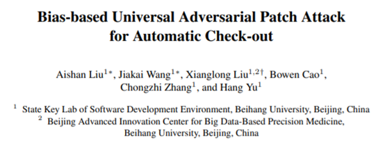

# ACOAttack

Code for the paper 

[Bias-based Universal Adversarial Patch Attack for Automatic Check-out](https://arxiv.org/pdf/2005.09257.pdf)
<br>[Aishan Liu](https://liuaishan.github.io/), Jiakai Wang, [Xianglong Liu](http://sites.nlsde.buaa.edu.cn/~xlliu/), Bowen Cao, Chongzhi Zhang, Hang Yu
<br>European Conference on Computer Vision (ECCV), 2020



This paper proposes a bias-based framework to generate class-agnostic universal adversarial patches with strong generalization ability, which exploits both the perceptual and semantic bias of models. Regarding the perceptual bias, since DNNs are strongly biased towards textures, we exploit the hard examples which convey strong model uncertainties and extract a textural patch prior from them by adopting the style similarities. The patch prioris more close to decision boundaries and would promote attacks. To further alleviate the heavy dependency on large amounts of data in training universal attacks, we further exploit the semantic bias. As the class-wise preference, prototypes are introduced and pursued by maximizing the multi-class margin to help universal training. Taking Automatic Check-out (ACO) as the typical scenario, extensive experiments including white-box/black-box settings in both digital-world (RPC, the largest ACO related dataset) and physical-world scenario (Taobao and JD, the world’s largest online shopping platforms) are conducted. Experimental results demonstrate that our proposed framework outperforms state-of-the-art adversarial patch attack methods.

For questions regarding implementation contact [Jiakai Wang](jk_buaa_scse@buaa.edu.cn)
# Examples

Examples on Taobao and JD platform

<video src="./attack-taobao.mp4" width="800px" height="600px" controls="controls"></video>
<video src="./attack-JD.mp4" width="800px" height="600px" controls="controls"></video>
# To Perform Attacks

## Fuse a Texture Patch Prior

With RPC dataset and the ground truth of hard examples, you can fuse a texture patch prior by running the following code.

```python
python Fushion.py
```

Hard examples refer to samples that was misclassified by your model.

## Generate Prototypes

To generate prototypes of class x, you can run:

```python
python gen_prototypes.py --class_id 
```

Make sure that you have modified the function *load_model* to load your own model.

## Train an Adversarial Patch

With RPC dataset, you can simply run:

```python
python FPA.py
```

If you want to train an adversarial patch on a mixed dataset of original images and prototypes, you can add a certain amount of prototypes to your dataset by adding the corresponding ground truth to the txt document with labels. 

## Digital Attacks

Once the training process finishes, you will get an adversarial patch. To perform digital attacks with this little patch, run:

```python
python attack.py
```

Now you can use see the classification result of the original/adversarial image.

## Real World Attacks

To perform attacks in real world, you can use a color printer to print out the patch and stick it on items to attack, and then take pictures with a camera to get adversarial examples.

# Prerequisite

Follow the instructions in [INSTALL](./src/target_model/install.md).

# Citing this work

If you find this work is useful in your research, please consider citing:

```
@inproceedings{Liu2020Biasbased,
    title={Bias-based Universal Adversarial Patch Attack for Automatic Check-out},
    author={Liu, Aishan and Wang, Jiakai and Liu, Xianglong and Cao, bowen and Zhang, Chongzhi and Yu, Hang},
    Booktitle = {European Conference on Computer Vision},
    year={2020}
}
```
